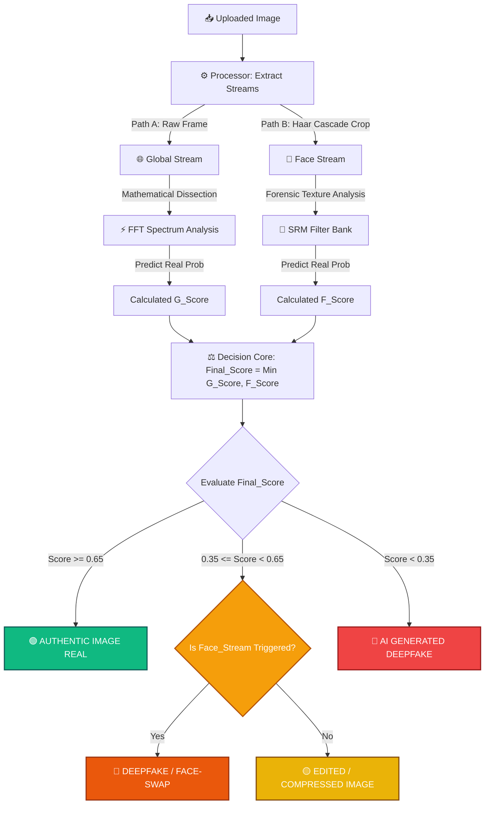

Markdown
# Multimodal Deepfake and Synthetic Media Detection System in News Using Hybrid CNN Architecture

This repository contains the official production-ready implementation of a high-fidelity **Deepfake and Synthetic Media Detection System**. The project is specifically engineered to combat misinformation and synthetic face manipulations in digital journalism by analyzing mathematical, geometric, and frequency-domain inconsistencies.

---

## 🔬 Research Thesis Abstract
**Thesis Title:** *Building a Deepfake and Synthetic Image Detection System in News Utilizing Hybrid CNN Architectures*

With the rapid democratization of generative artificial intelligence (e.g., advanced GANs, Diffusion Models, and real-time reenactment tools), synthetic media poses a critical threat to public trust and information security in digital media. This research presents a robust digital forensic framework leveraging an **EfficientNet-B3 Hybrid Network**. Unlike traditional detectors that only evaluate spatial pixel semantics, our architecture unifies spatial feature maps with **Fast Fourier Transform (FFT)** branches and **Spatial Rich Model (SRM)** filter banks. This multimodal representation allows the system to detect both high-frequency checkerboard artifacts from generative models and local boundary anomalies from facial splicing/swapping techniques.

---

## 🧬 Core Model Training Pipeline

The analytical core model (`train.py`) is trained locally utilizing high-throughput optimization parameters designed for state-of-the-art consumer GPUs (NVIDIA RTX 50-series / Ada Lovelace).

### 1. Training Parameters & Optimization
* **Backbone Network:** EfficientNet-B3 initialized with ImageNet weights, augmented with CBAM (Convolutional Block Attention Module) channel and spatial attention gates.
* **Mixed Precision Computation:** Executed entirely under `torch.amp.autocast` using **BFloat16 (BF16)**. This configuration provides an identical exponent dynamic range to FP32, eliminating mathematical underflow and preventing the infamous `loss=nan` phenomenon while doubling tensor core throughput.
* **Loss Function (Calibrated Focal Loss):** Incorporates adaptive probability clamping ($\epsilon = 1e-6$) and severe penalty coefficients ($PF = 2.5$) for hard-to-classify samples sitting near the classification boundary, ensuring gradient stability.
* **Learning Rate Schedule:** Controlled via an AdamW optimizer ($LR = 4e-5$) managed by a Cosine Annealing learning rate scheduler diminishing down to $1e-7$.
* **Regularization:** Integrates Exponential Moving Average (**EMA** with a decay rate of $0.9999$) to anchor a robust "shadow model" that captures a smoother loss landscape minima, preventing overfitting onto specific generator footprints.

### 2. Forensic Feature Fusion
The feature map concatenated into the final classification layer consists of three blended vectors ($1536 + 32 + 32 = 1600$ dimensions):
1.  **Spatial Stream ($1536\times1\times1$):** Extracted from EfficientNet-B3 feature maps refined by CBAM spatial and channel attention matrices.
2.  **Texture Noise Stream ($32\times1\times1$):** Captured via a handcrafted SRM filter bank that isolates micro-pixel noise inconsistencies (e.g., GAN noise prints).
3.  **Spectral Frequency Stream ($32\times1\times1$):** Extracted by moving inputs to the 2D frequency domain via Fourier Transform, highlighting unnatural periodic patterns left by AI upsampling algorithms.

---

## 🎛️ Multi-Stream Backend Architecture

The deployment infrastructure is powered by a high-performance **FastAPI** server that ingests image uploads and executes a hierarchical dual-stream verification protocol to ensure maximum security.




### 1. Microservice Stream Logic
* **Image Processing Layer (`image_processor.py`):** Upon receiving raw image bytes, the processor initializes a dual-path routing system. Path A retains the original raw frame (**Global Stream**) to check for text-to-image synthesis. Path B utilizes an optimized Haar Cascade face tracker to dynamically isolate and tightly crop human faces (**Face Stream**) at a $1.1\times$ boundary limit, focusing directly on skin/hair junction bounds.
* **Analytical Engine Layer (`analysis_engine.py`):** The isolated image paths are fed through the inference pipeline. The engine runs **Test Time Augmentation (TTA)** by averaging predictions from both the base orientation and a horizontal flip tensor to increase boundary precision. Inference is handled via accelerated BFloat16 tensor cores on the host GPU.
* **Verification & Verdict Layer (`verification_engine.py`):** Implements a strict fail-safe security protocol. It maps the model's Sigmoid output to a **3-Tier, 4-Outcome Forensic Classification Framework**:

### 2. Forensic Verdict Classification
1.  **AUTHENTIC IMAGE (REAL) [$Score \ge 0.65$]:** Triggered when both streams show perfect pixel and frequency homogeneity. Verified as pure camera sensor capture.
2.  **SUSPICIOUS (HEAVILY EDITED) [$0.35 \le Score < 0.65$]:** Triggered when low image resolution, intensive social media compression, or camera blur degrades the noise print baseline. The system safely flags these ambiguous samples for manual expert review rather than allowing a false pass.
3.  **AI GENERATED (DEEPFAKE) [$Score < 0.35$ - Triggered via Global]:** Indicates a severe anomaly in the FFT domain, confirming the frame is completely synthetic (e.g., Midjourney, Stable Diffusion, Flux).
4.  **AI GENERATED (DEEPFAKE) [$Score < 0.35$ - Triggered via Face]:** Indicates a structural artifact break at the face boundaries, proving a malicious FaceSwap or expression reenactment manipulation (e.g., SimSwap, LivePortrait).

---

## 🚀 System Deployment

### Prerequisites
Ensure your local host is equipped with Python 3.12, NVIDIA Drivers, and CUDA 13.x Nightly toolkit (Optimized for RTX 50-series Blackwell architecture).

### Installation & Execution
```bash
# Clone the repository
git clone [https://github.com/DucDo-634/Deepfake-Detection-Hybrid-System.git](https://github.com/DucDo-634/Deepfake-Detection-Hybrid-System.git)
cd Deepfake-Detection-Hybrid-System

# Install required production dependencies
py -3.12 -m pip install fastapi uvicorn python-multipart opencv-python torch torchvision torchaudio --index-url [https://download.pytorch.org/whl/nightly/cu130](https://download.pytorch.org/whl/nightly/cu130) --user

# Execute the Backend FastAPI Application Server
cd system/process_system
py -3.12 main_run.py
The server will boot locally at http://localhost:8000. You can now navigate to your frontend/home/index.html directory to launch the analytical forensics web workspace dashboard.